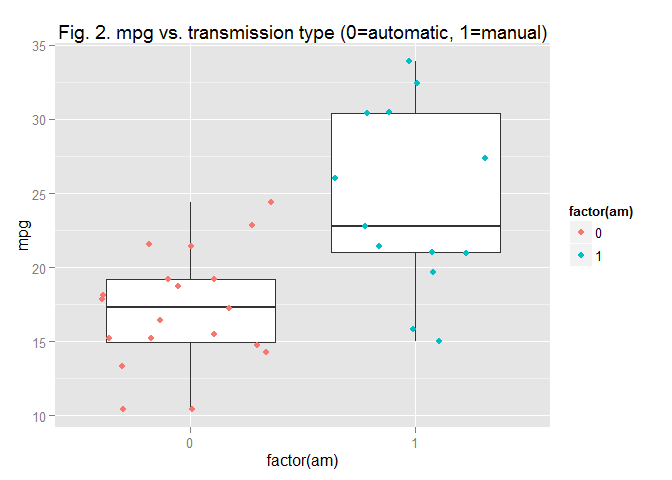
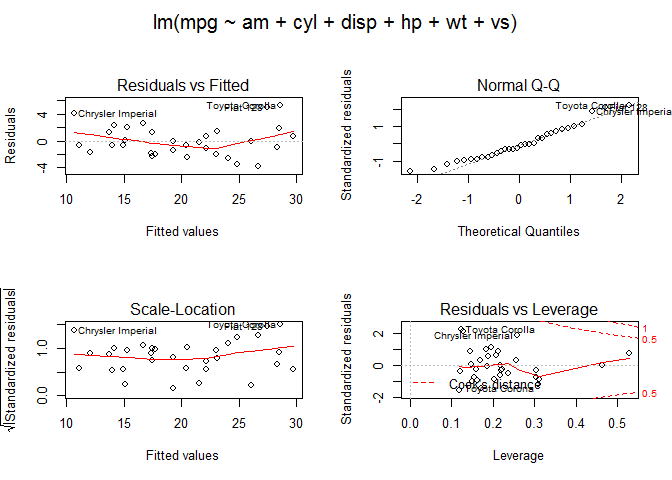

# A study of the relationship between transmission type and fuel usage with mtcars dataset
aamin  
20 June 2015  

### Executive Summary

Using the mtcars dataset, we investigate the relationship between miles per gallon (mpg) and other car properties, such as transmission type (am). In the first part of the report, we do exploratory analysis to understand the mtcars dataset and to see how different car properties influence mpg values of cars. We found out that there maybe multiple variables that has correlation with mpg values. 
In the second part of the report, we did several analysis: t-test analysis, anova analysis, and regression analysis. The tests shows that transmission types has a significant difference with the performance of mpg of cars. Specifically manual transmission type is provides 1.4 times higher mpg than automatic transmission type. 
However, we showed that transmission type is not the only variables that has strong correlation with with mpg. Therefore using in total 6 variables, we derived the best linier model to predict mpg outcome.

### Exploratory Analysis

#### The mtcars data -
The data was extracted from the 1974 Motor Trend US magazine, and comprises fuel consumption and 10 aspects of automobile design and performance for 32 automobiles (1973-74 models). The data consist of 32 obs. of  11 variables.
https://stat.ethz.ch/R-manual/R-devel/library/datasets/html/mtcars.html


In figure 1 (see appendix), we plot pairs of mpg against all other variables and found that there seems to be a negative correlation between mpg and cyl, disp, hp, and wt, and a positive correlation between mpg with vs, and am.
Other variables eventhough there shows some level tendecy has a lot of variances. 
Next we further investigate the correlations of individual variables with mpg.

### Analysis

#### Analysis 1: Does transmission type have an correlation on mpg value?
In order to answer this question, we will do a t-test to compare the effect of different transmission types with mpg outcome. Please refer to boxplot in appendix figure 2.

In this test we assume:

* independent samples 
* all analysis will assume unequal variance

```r
diff <- t.test(mpg~am, paired = FALSE, var.equal = FALSE, data = mtcars)
print(diff$conf)
```

```
## [1] -11.280194  -3.209684
## attr(,"conf.level")
## [1] 0.95
```

We reject the null hypothesis and conclude that there is significant difference between the different transmission type (manual vs. automatic)

```r
print(diff$estimate)
```

```
## mean in group 0 mean in group 1 
##        17.14737        24.39231
```
Manual transmission is about 1.4 times higher mpg than automatic transmission.

Next, we will analyze the relationships between the variables to predict mpg with several models to see which of the variables is a better predictor on mpg outcome.

#### Analysis 2: Is transmission type the only variable that influences mpg? What are the car variables which have strong correlation with mpg?

We can see from anova test below that in addition to am, 5 other variables, namely cyl, disp, hp, wt and vs is a strong predictor to mpg outcome. The anova test shows significant result when taking into account of these 6 variables. 
The test also shows that the variables qsec, drat, gear and carb is not the best predictor.


```r
fita <- lm(mpg ~ am, data = mtcars)
fitb <- update(fita, mpg ~ am + cyl + disp + hp + wt + vs)
fitc <- update(fitb, mpg ~ am + cyl + disp + hp + wt + vs + qsec )
fitd <- update(fitc, mpg ~ am + cyl + disp + hp + wt + vs + qsec + drat )
fite <- update(fitd, mpg ~ am + cyl + disp + hp + wt + vs + qsec + drat + gear )
fitf <- update(fite, mpg ~ am + cyl + disp + hp + wt + vs + qsec + drat + gear + carb)
anova(fita, fitb, fitc, fitd, fite, fitf)
```

```
## Analysis of Variance Table
## 
## Model 1: mpg ~ am
## Model 2: mpg ~ am + cyl + disp + hp + wt + vs
## Model 3: mpg ~ am + cyl + disp + hp + wt + vs + qsec
## Model 4: mpg ~ am + cyl + disp + hp + wt + vs + qsec + drat
## Model 5: mpg ~ am + cyl + disp + hp + wt + vs + qsec + drat + gear
## Model 6: mpg ~ am + cyl + disp + hp + wt + vs + qsec + drat + gear + carb
##   Res.Df    RSS Df Sum of Sq       F    Pr(>F)    
## 1     30 720.90                                   
## 2     25 159.52  5    561.38 15.9855 1.532e-06 ***
## 3     24 150.76  1      8.76  1.2477    0.2766    
## 4     23 148.87  1      1.89  0.2685    0.6098    
## 5     22 147.90  1      0.97  0.1384    0.7137    
## 6     21 147.49  1      0.41  0.0579    0.8122    
## ---
## Signif. codes:  0 '***' 0.001 '**' 0.01 '*' 0.05 '.' 0.1 ' ' 1
```

#### Analysis 3: Regression Analysis
Based on analysis 2, we can now confidently specify the best linier model to predict mpg outcome, and it is based not only on transmission type but also 5 other variables. Refer to figure 3 in appendix for its diagnistics and residual plot.


```r
bestliniermodel <- lm(mpg ~ am + cyl + disp + hp + wt + vs, data=mtcars)
print(bestliniermodel$coef)
```

```
## (Intercept)          am         cyl        disp          hp          wt 
## 34.96611186  2.14087716 -0.73198472  0.01310641 -0.02925680 -3.27738570 
##          vs 
##  1.36177917
```


### Conclusion

The transmission type has a significant influence on mpg performance. The t-test shows that manual transmission cars provides better miles per gallon than automatic transmission type. However, this is not the only meaningful variable. In addition to transmission type, number of cylinders (cyl), displacement type (dsp), horse power (hp), car weight (wt), and vs.


### Appendix


Figure 1. Motor Trend Car Road Test (mtcars) Pair Graph

```r
pairs(mtcars, panel=panel.smooth, main="Fig. 1. Motor Trend Car Road Test (mtcars) Pair Graph")
```

 
Figure 2. mpg vs. transmission type (0=automatic, 1=manual)

```r
p <- ggplot(mtcars, aes(factor(am), mpg))
p + geom_boxplot() + geom_jitter(aes(color=factor(am))) + 
        ggtitle("Fig. 2. mpg vs. transmission type (0=automatic, 1=manual)")
```

 
Figure 3.Best Linier Model Residual Plot and Diagnistics

```r
par(oma=c(0,0,2,0))
par(mfrow=c(2,2))
plot(bestliniermodel) 
```

 


