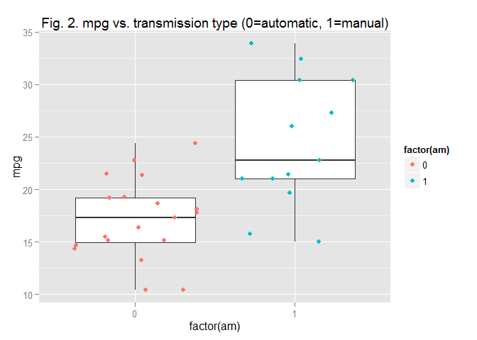

# A study of the relationship between transmission type and fuel usage with mtcars dataset
aamin  
27 April 2015  

### Executive Summary

Using the mtcars dataset, we investigate the relationship between miles per gallon (mpg) and other car properties, such as transmission type (am). In the first part of the report, we do exploratory analysis to under stand the mtcars dataset and to see how different car properties influence mpg values of cars. Further more we use t-test to show that transmission types has a significant difference with the performance of mpg of cars. Specifically manual transmission type is provides 1.4 times higher mpg than automatic transmission type. Finally we determine an optimum liniear regression model with highest adjusted R-squared value to explain the relationship between the different cars properties, as independent variable, to the mpg.

### Exploratory Analysis

#### The mtcars Data

The data was extracted from the 1974 Motor Trend US magazine, and comprises fuel consumption and 10 aspects of automobile design and performance for 32 automobiles (1973-74 models). The data consist of 32 obs. of  11 variables.

https://stat.ethz.ch/R-manual/R-devel/library/datasets/html/mtcars.html


```r
head(mtcars,3)
```

```
##                mpg cyl disp  hp drat    wt  qsec vs am gear carb
## Mazda RX4     21.0   6  160 110 3.90 2.620 16.46  0  1    4    4
## Mazda RX4 Wag 21.0   6  160 110 3.90 2.875 17.02  0  1    4    4
## Datsun 710    22.8   4  108  93 3.85 2.320 18.61  1  1    4    1
```

In figure 1 (see appendix), we plot pairs of mpg against all other variables and found that there seems to be a negative correlation between mpg and cyl, disp, hp, and wt, and a positive correlation between mpg with vs, and am.
And other variables eventhough there shows some level tendecy has a lot of variances. Therefore we will take these 6 variables (cyl, disp, hp, wt, va and am) in our regression analysis and model search.

### Analysis

#### Analysis 1: Does transmission type have an correlation on mpg value?
In order to answer this question, we will do a t-test to compare the effect of different transmission types with mpg outcome. Please refer to boxplot in appendix figure 2.

In this test we assume:

* independent samples 
* all analysis will assume unequal variance


```r
diff <- t.test(mpg~am, paired = FALSE, var.equal = FALSE, data = mtcars)
print(diff$conf)
```

```
## [1] -11.280194  -3.209684
## attr(,"conf.level")
## [1] 0.95
```

We reject the null hypothesis and conclude that there is significant difference between the different transmission type (manual vs. automatic)


```r
print(diff$estimate)
```

```
## mean in group 0 mean in group 1 
##        17.14737        24.39231
```
Manual transmission is about 1.4 times higher mpg than automatic transmission.


Next, we will analyze the relationships between the variables to predict mpg with several models to see which of the variables is a better predictor on mpg outcome.

#### Analysis 2: Is transmission type the only variable that influences mpg? What are the car variables which have strong correlation with mpg?


```r
fita <- lm(mpg ~ am, data = mtcars)
fitb <- update(fita, mpg ~ am + cyl + disp + hp + wt + vs)
fitc <- update(fitb, mpg ~ am + cyl + disp + hp + wt + vs + qsec )
fitd <- update(fitc, mpg ~ am + cyl + disp + hp + wt + vs + qsec + drat )
fite <- update(fitd, mpg ~ am + cyl + disp + hp + wt + vs + qsec + drat + gear )
fitf <- update(fite, mpg ~ am + cyl + disp + hp + wt + vs + qsec + drat + gear + carb)

anova(fita, fitb, fitc, fitd, fite, fitf)
```

```
## Analysis of Variance Table
## 
## Model 1: mpg ~ am
## Model 2: mpg ~ am + cyl + disp + hp + wt + vs
## Model 3: mpg ~ am + cyl + disp + hp + wt + vs + qsec
## Model 4: mpg ~ am + cyl + disp + hp + wt + vs + qsec + drat
## Model 5: mpg ~ am + cyl + disp + hp + wt + vs + qsec + drat + gear
## Model 6: mpg ~ am + cyl + disp + hp + wt + vs + qsec + drat + gear + carb
##   Res.Df    RSS Df Sum of Sq       F    Pr(>F)    
## 1     30 720.90                                   
## 2     25 159.52  5    561.38 15.9855 1.532e-06 ***
## 3     24 150.76  1      8.76  1.2477    0.2766    
## 4     23 148.87  1      1.89  0.2685    0.6098    
## 5     22 147.90  1      0.97  0.1384    0.7137    
## 6     21 147.49  1      0.41  0.0579    0.8122    
## ---
## Signif. codes:  0 '***' 0.001 '**' 0.01 '*' 0.05 '.' 0.1 ' ' 1
```
We can see from anova test that in addition to am, 5 other variables, namely cyl, disp, hp, wt and vs is a strong predictor to mpg outcome. The anova test shows significant result when taking into account of these 6 variables. 
The test also shows that the variables qsec, drat, gear and carb is not the best predictor.


#### Analysis 3: Regression Analysis

```r
regmodel1 <- lm(mpg ~ am + cyl + disp + hp + wt + vs, data=mtcars)
#print(regmodel1$coef)
print(summary(regmodel1))
```

```
## 
## Call:
## lm(formula = mpg ~ am + cyl + disp + hp + wt + vs, data = mtcars)
## 
## Residuals:
##     Min      1Q  Median      3Q     Max 
## -3.8319 -1.7327 -0.4034  1.3154  5.3430 
## 
## Coefficients:
##             Estimate Std. Error t value Pr(>|t|)    
## (Intercept) 34.96611    5.68062   6.155 1.95e-06 ***
## am           2.14088    1.64807   1.299  0.20579    
## cyl         -0.73198    0.84488  -0.866  0.39452    
## disp         0.01311    0.01186   1.105  0.27964    
## hp          -0.02926    0.01415  -2.068  0.04911 *  
## wt          -3.27739    1.14376  -2.865  0.00832 ** 
## vs           1.36178    1.81343   0.751  0.45970    
## ---
## Signif. codes:  0 '***' 0.001 '**' 0.01 '*' 0.05 '.' 0.1 ' ' 1
## 
## Residual standard error: 2.526 on 25 degrees of freedom
## Multiple R-squared:  0.8583,	Adjusted R-squared:  0.8243 
## F-statistic: 25.25 on 6 and 25 DF,  p-value: 1.817e-09
```


### Conclusion

The transmission type has a significant influence on mpg performance. However, this is not the only meaningful variable. In addition to transmission type, number of cylinders (cyl), displacement type (dsp), horse power (hp), car weight (wt), and vs.
The t-test shows that manual transmission cars provides better miles per gallon than automatic transmission type.


### Appendix


Figure 1.

```r
pairs(mtcars, panel=panel.smooth, main="Fig. 1. Motor Trend Car Road Test (mtcars) Pair Graph")
```

 

Figure 2. 

```r
p <- ggplot(mtcars, aes(factor(am), mpg))
p + geom_boxplot() + geom_jitter(aes(color=factor(am))) + 
        ggtitle("Fig. 2. mpg vs. transmission type (0=automatic, 1=manual)")
```

 
